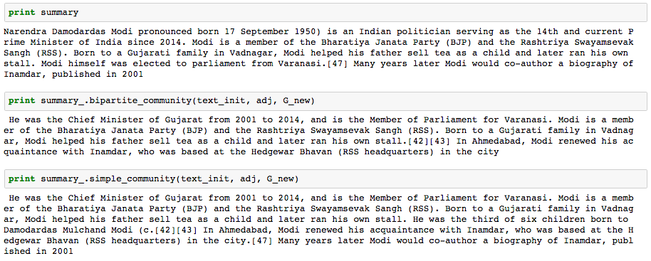

# Text_Summariser

For detailed working, refer to Jupyter Notebook

### Usage
#### LexRank Summary
```python
import summary_pa as sumpal 

text = "<SOME TEXT>"  

summary, sentences, adj_matrix, G = sumpal.summary(text, n)  
print summary
```
- summary - Summary of n sentences
- sentences - List of sentences
- adj_matrix - Matrix with edge weights
- G - Graph with nodes as sentences and edges as similarity values

#### C-LexRank Summary

##### Community Detection
```python
summary, sentences, adj_matrix, G = sumpal.summary(text, n)  
simple_summary = sumpal.simple_community(sentences, adj_matrix, G)

print simple_summary
```
##### Bipartite Communities

```python
summary, sentences, adj_matrix, G = sumpal.summary(text, n)  
bipar_summary = sumpal.bipartite_community(sentences, adj_matrix, G)

print bipar_summary
```
### Example
Text - Narendra Modi's Wikipedia Page (https://en.wikipedia.org/wiki/Narendra_Modi)

Summary (5 Lines)

